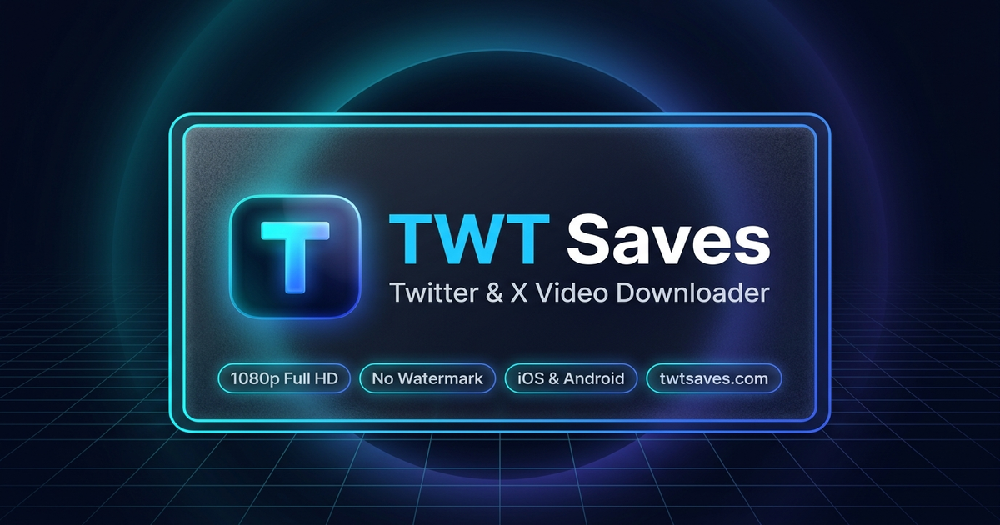

<div align="center">

# ⚡ TWT Saves — Twitter (X) Video Downloader

[](https://twtsaves.com)
[](https://github.com/jod-prime/twtsaves.com)
[](https://twtsaves.com)
[](https://twtsaves.com)
[](https://twtsaves.com)
[](https://twtsaves.com)

<br/>



<p align="center">
  <b>High-speed, watermark-free Twitter (X) video downloader, browser extension, and iOS Siri shortcut.</b><br/>
  Save public videos, animated GIF loops, and Spaces audio in Full HD 1080p, 720p, and universal MP4 formats.
</p>

[**🌐 Launch Web Downloader**](https://twtsaves.com) • [**🧩 Chrome Extension**](#-chrome--brave-extension) • [**📱 Apple Siri Shortcut**](#-apple-ios-siri-shortcut) • [**💡 URL Prefix Trick**](#-the-twt-url-prefix-trick)

</div>

---

## 🚀 Overview

**TWT Saves** ([twtsaves.com](https://twtsaves.com)) is an independent, lightning-fast web utility engineered to extract and archive publicly accessible media from Twitter and X.com. 

Unlike traditional tools that compress video streams or slap promotional watermarks onto media, **TWT Saves** resolves the original high-bitrate source streams directly from Twitter's Content Delivery Network (CDN) to ensure 100% original quality.

### ✨ Key Features

- 🎯 **1080p Full HD Resolution:** Parses adaptive HLS streams to provide the highest available video bitrate (1080p, 720p, 480p, 360p).
- 🛡️ **Zero Watermarks:** Pristine, unaltered video files without re-encoding or brand stamps.
- 📱 **Native Apple iOS Safari Support:** Direct integration with the native Apple Photos Camera Roll on iPhone and iPad.
- 🎵 **Twitter Spaces & Audio to MP3:** Extract high-quality audio streams from videos and Spaces in 320kbps / 192kbps / 128kbps MP3 format.
- 🔄 **Looping GIFs to MP4:** Converts Twitter's internal animated GIF loops into universal MP4 files ready for WhatsApp, Telegram, and Discord.
- 🔒 **100% Free & Private:** No user registration, no accounts, no password requests, and zero request logging.

---

## 📦 Direct Downloads & Client Tools

This repository provides ready-to-use client packages to download Twitter videos effortlessly across all your devices:

| Tool | Platform | Package File | Direct Link |
| :--- | :--- | :--- | :--- |
| **Chrome Extension** | Chrome, Brave, Edge, Opera | `twt-saves-extension.zip` | [**Download Extension**](downloads/twt-saves-extension.zip) |
| **Apple Siri Shortcut** | iPhone, iPad (iOS 16+) | `TWT-Saves.shortcut` | [**Download Shortcut**](downloads/TWT-Saves.shortcut) |
| **Official Web App** | Any Modern Web Browser | `twtsaves.com` | [**Open twtsaves.com**](https://twtsaves.com) |

---

## 🧩 Chrome & Brave Extension

The official **TWT Saves Extension** injects an instant **"Download HD"** button directly beneath every video and GIF in your Twitter feed.

```
Tweet Feed ──> Click "Download HD" ──> Instant 1080p MP4 Download
```

### Installation Guide (Developer Mode)

1. Download [`downloads/twt-saves-extension.zip`](downloads/twt-saves-extension.zip).
2. Unzip the archive to a local folder on your computer.
3. Open your Chromium browser and navigate to the extensions management page:
   - **Chrome:** `chrome://extensions`
   - **Brave:** `brave://extensions`
   - **Edge:** `edge://extensions`
4. Toggle **"Developer mode"** in the top right corner.
5. Click **"Load unpacked"** and select the unzipped extension directory.
6. Refresh [x.com](https://x.com) — you will now see high-speed download buttons under every media post!

---

## 📱 Apple iOS Siri Shortcut

Save Twitter videos directly into your iPhone's **Apple Photos** Camera Roll in a single tap through the native iOS Share Sheet.

### Installation Guide (iPhone & iPad)

1. On your iOS device, download [`downloads/TWT-Saves.shortcut`](downloads/TWT-Saves.shortcut).
2. Tap the file in **Files** or Safari to import it directly into the native **Apple Shortcuts** app.
3. Tap **"Add Shortcut"**.
4. Open the **X (Twitter)** app, find any video post, tap the **Share** button, select **"Share via..."**, and choose **"TWT Saves"**.
5. The video will be parsed and saved straight to your **Camera Roll**!

---

## 💡 The "TWT" URL Prefix Trick

Save any video without leaving Twitter, opening extra tabs, or copying links manually:

Simply type **`twtsaves.com/`** in front of any tweet URL in your browser's address bar and hit **Enter**!

#### Example:
```diff
- https://x.com/sports/status/1838848483
+ twtsaves.com/https://x.com/sports/status/1838848483
```

You will instantly land on the resolution selection section with your video ready to download in 1080p Full HD!

---

## 🌐 Live Web Preview & GitHub Pages

This repository includes a standalone web client ([`index.html`](index.html), [`styles.css`](styles.css), [`app.js`](app.js)) that can be hosted instantly on **GitHub Pages**:

### How to Enable GitHub Pages:

1. In your GitHub repository settings, navigate to **Pages** (`Settings -> Pages`).
2. Under **Build and deployment -> Source**, select **Deploy from a branch**.
3. Choose branch: `main` (or current default), folder: `/ (root)`.
4. Click **Save**.
5. Your public web client will be live at:
   ```
   https://jod-prime.github.io/twtsaves.com/
   ```

When users enter a Twitter URL on this client, it automatically validates the link and redirects to `https://twtsaves.com/?url=...`, automatically landing them directly in the video resolution selection section.

---

## ⚖️ Legal & Disclaimer

- **TWT Saves** is an independent third-party web utility and is **not affiliated with, associated with, or endorsed by X Corp. or Twitter**.
- All trademarks, logos, and copyrights belong to their respective owners.
- TWT Saves does not host, store, or archive copyrighted media files on its servers. All media is streamed directly from Twitter's official Content Delivery Networks (CDNs) to the user's browser cache.
- Users are solely responsible for ensuring they have the legal right or permission to download and archive content.

---

<div align="center">
  <sub>Maintained with ❤️ by the TWT Saves Team • Powered by <a href="https://twtsaves.com">twtsaves.com</a></sub>
</div>
